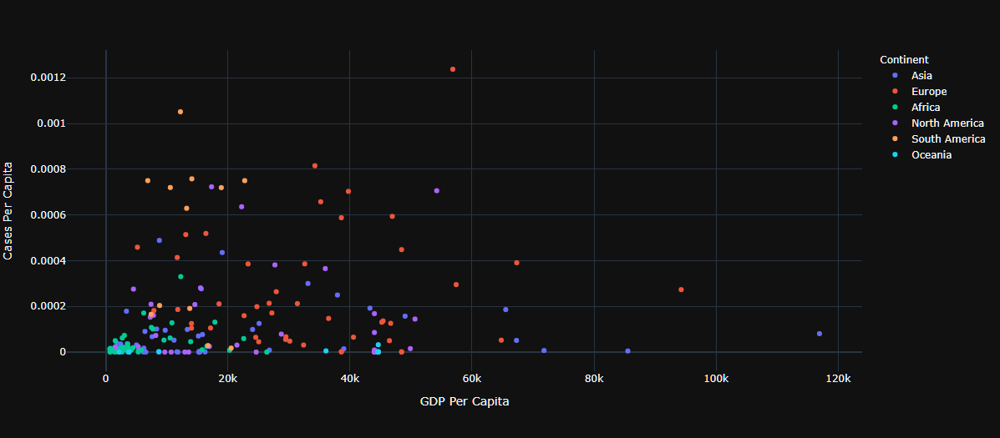
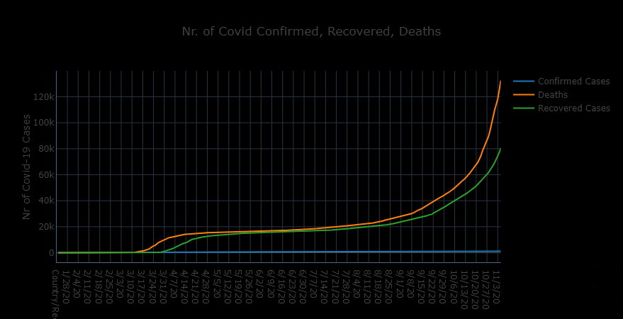
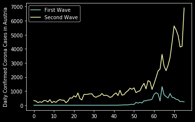
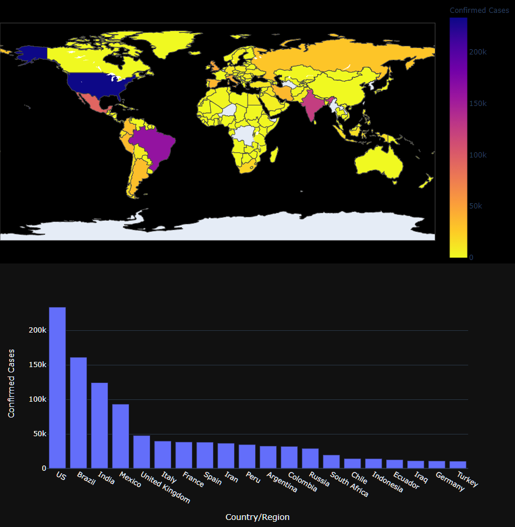

```{r setup, include=FALSE}
knitr::opts_chunk$set(echo = TRUE)
```

\newpage

# Introduction

As part of this assignment I've created the *vira!ert* (read viralert) dashboard, which presents covid data in different visualizations on a country level. The dashboard fetches updated data from two sources:

* [COVID-19 Data Repository by the Center for Systems Science and Engineering (CSSE) at Johns Hopkins University](https://github.com/CSSEGISandData/COVID-19) - This is the data repository for the 2019 Novel Coronavirus Visual Dashboard operated by the Johns Hopkins University Center for Systems Science and Engineering (JHU CSSE)
* [ourworldindata.org/coronavirus](https://ourworldindata.org/coronavirus-testing) -  Data on COVID-19 (coronavirus) confirmed cases, deaths, and tests • All countries • Updated daily by Our World in Data

Due to this, the dashboard is always up to date with the latest data for each country automatically. Therefore, there isn't a requirement for updating the data by hand. The data covers the whole covid timeline data from the 22th of January until now.

The only problem with the data was merging the timelines together from both sources. For this I've used the already present ISO-Alpha_3 codes in the ourworldindata.org data and used the pycountry python package to find the respective codes for the countries there and then merged the data based on those.

I used the Independent T-test, the Pearson Correlation, and a simple percentage comparison to test the statistical significance. For the Independent T-test, the null hypothesis was considered to be significant if the p-value was higher than the significance level of 0.05; for Pearson Correlation, the hypothesis was considered to be significant if the correlation coefficient was higher than 0.5; as for the percentage comparison, the majority was considered everything above 50%.

# Describe data insight no. 1

## What is the interesting fact you found in the data?

There is a correlation between the wealth of a country (GDP) and the amount of Corona Cases they have, relative to the population.

## Give a brief description (~ one paragraph) how you discovered the insight.

I was hoping to find a correlation between GDP and Cases in a country, with the logic that the poorer a country is the more cases of COVID-19 there are going to be in that country. After scatter-plotting GDP Per Capita and Cases per Capita, as can be seen in Figure 1. There seems to be a slight correlation if we ignore the countries for which the Cases per Population seems to be 0 due to missing data.

## Choose an appropriate visualization to show the insight.

```{r, echo=FALSE, out.width="100%", fig.align="center", fig.cap="Scatterplot of All Corona Infected Countries by GDP Per Capita and Cases Per Capita"}

```

## How did you test the statistical significance of the insight?

To confirm this insight I used the Pearson Correlation Coefficient and got a correlation value of 0.38. Meaning that there is a correlation between the two above mentioned columns, albeit not a strong one. Due to the correlation value being so low, we deem the insight as not statistically significant.

# Describe data insight no. 2

## What is the interesting fact you found in the data?

There is a second wave of COVID-19 in Austria.

## Give a brief description (~ one paragraph) how you discovered the insight.

Looking at the time-series data of Confirmed Cases, Deaths, and Recoveries in Austria, as shown in Figure 2, there can be seen a great increase of confirmed cases after some time at the beginning of April when a lot of the lockdown restrictions were lifted in Austria.

## Choose an appropriate visualization to show the insight.

```{r, echo=FALSE, out.width="100%", fig.align="center", fig.cap="Timeseries of amount of Confirmed Corona, Recovered and Deaths Cases for Austria"}

```

```{r, echo=FALSE, out.width="100%", fig.align="center", fig.cap="Timeseries of amount of daily Confirmed Corona Cases for Austria"}

```

## How did you test the statistical significance of the insight?

I've set the null hypothesis that the distribution and means of the daily new cases for the first and wave being the same. After which I've calculated the T-test for the means of two independent samples and got a p-value of `1.3007700245958413e-10` meaning that the two samples are not similar and there is a difference between the waves, therefore rejecting our null hypothesis. This can also be further confirmed by comparing the two time series of the two waves, where it is obvious that the second wave has many more cases than the first one, which can be seen in Figure 3.

# Describe data insight no. 3

## What is the interesting fact you found in the data?

The United States, Brazil, and India make up the majority of daily confirmed Corona cases in the world.

## Give a brief description (~ one paragraph) how you discovered the insight.

Looking at the Choropleth map of daily new confirmed cases for multiple past dates we can see that always the US, India, and Brazil are colored in purple/blueish colors at the upper end of the confirmed cases color scale. Moreover, if we take a look at the bars plot we get a more quantifiable visualization where the difference between confirmed cases becomes clearer.

## Choose an appropriate visualization to show the insight.

```{r, echo=FALSE, out.width="100%", fig.align="center", fig.cap="Top a) Choropleth map of Confirmed Cases for all Countries, Bottom b) Bar Plot of Confirmed Cases for Top 20 Countries with most cases"}

```

## How did you test the statistical significance of the insight?

For this insight, I looked at the daily confirmed cases for the US, India, and Brazil and compared them to the daily confirmed cases of the remaining countries. For this, I just calculated the daily total cases and calculate the percentage of which of those belong to the US, India, and Brazil, and the rest. I used two different time slots for this comparison and in both cases, I've only got around 30%~ (30% for the last week and 37% for the last month). This seems to be consistent and in fact, proves that our insight only based on our visualization seems to be incorrect. The max amount of contribution of daily confirmed cases in the analyzed time slots from the US, India, and Brazil was 48%. Therefore, placing them below the 50.1% threshold line and not making up the majority of daily confirmed cases in the world.

# Comparison exploration vs. confirmation

In step 2 of task 2 you were asked to note down all the insights you found in the data. How many of them actually proved to be statistically significant?

Out of the three insights found, only insight 2 was statistically significant, and the remaining insights proved themselves not statistically significant.
